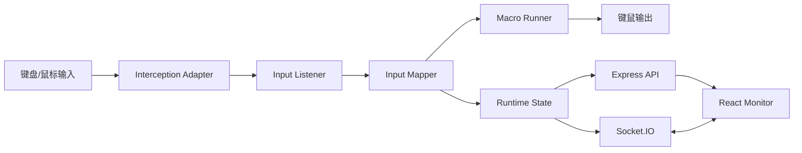

# 项目源代码架构、设计与性能深度评估报告

[下载 Markdown 报告](sandbox:/mnt/data/cs2-jumpthrow-ez-review-2026-05-23.md)

## 目录

- 执行摘要
- 项目上下文与前提
- 静态分析与构建依赖
- 架构与设计评估
- 性能、安全与质量保障
- 迁移部署与实施计划
- 开放问题与局限

## 执行摘要

你上传的项目与公开仓库 `Evanpatchouli/cs2-jumpthrow-ez` 一致：它是一个基于 Node.js 的 Windows 输入拦截示例项目，README 明确说明需要安装 `node-interception` 驱动、以管理员权限执行安装命令，并在重启后完成驱动启用；项目同时包含一个 Express + Socket.IO 服务端，以及一个使用 Vite + React 构建的监控端。仓库公开目录包含 `core`、`handlers`、`server`、`monitor`、`scripts`、`pm2` 等部分。本次重构已将运行时收敛为 Node.js 26.2.0。`node-interception` 官方仓库已于 2025 年 9 月归档，这意味着该项目的底层输入驱动能力依赖一个已停止活跃维护的核心组件。citeturn1view0turn4view1turn1view1

基于对上传压缩包的本地静态扫描，我的判断是：这个项目当前最主要的问题并不是“单点算法慢”，而是**职责集中、生命周期管理不完整、安全面暴露、依赖老化、可测试性弱**。其中，`core/index.js` 事实上成了一个“上帝模块”；公开文件页显示它达 442 行，而 `handlers/index.js` 负责宏动作组合，`server/router/index.js` 直接暴露 `/status`、`/start`、`/stop` 控制接口。高优先级改进应聚焦在四件事：**修复运行时缺陷、收敛模块边界、收紧安全控制面、建立测试与发布基线**。citeturn5view0turn5view2turn7view7

如果只给一个总评，我会把这个项目定义为：**功能原型已经可用，但工程化成熟度还停留在“个人项目/实验项目”阶段**。把它提升到可持续维护的水平，大约可以分成两个波次推进：先做稳定性与安全的止血，再做架构收敛与工程化补强。对于当前代码库，我建议把第一波工作放在一周内完成。这个结论同时受到项目自身公开实现、React/Express/Socket.IO 官方最佳实践、npm 安全审计机制、Docker 与 PM2 官方部署建议的共同支持。citeturn10search0turn9search1turn9search6turn18search1turn15search0turn9search3

## 项目上下文与前提

项目源码已经提供，但仍有一组关键前提信息没有在仓库里完整表达出来，包括：目标 Node.js 版本、Windows 版本与输入驱动安装策略、实际部署拓扑、监控与告警平台、并发规模、性能基线、测试覆盖率、CI/CD 约束、以及是否需要多机部署。`app.config.js` 只给出了本地服务地址、端口、监控路径和一个简单的客户端标识；Vite 官方文档则明确说明更适合把环境差异放进 `.env` / `.env.[mode]`，并由构建时模式优先级加载；PM2 官方文档也更推荐使用 `ecosystem.config.js` 这类配置文件来管理多环境参数，而不是继续把绝对路径和环境写死在 JSON 或脚本里。citeturn8view4turn6view0turn11search1turn9search3turn9search11

更具体地说，`package.json` 当前脚本使用 Windows 风格的 `set NODE_ENV=production && ...`，而 README 又要求在 PM2 配置里手工调整 `cwd`、`interpreter`、日志路径等参数；这说明项目的构建与运行方式高度依赖本地开发者环境，不具备天然可移植性。与此同时，Vite 官方文档对嵌套路由部署给出了标准做法：如果前端要部署在 `/monitor/` 之类的子路径下，应通过 `base` 配置而不是散落在脚本和拷贝流程里的硬编码路径来处理。citeturn4view1turn1view0turn11search0

建议先补齐以下信息，再进入第二阶段优化：

| 未提供信息 | 对分析的影响 | 建议获取方式 |
|---|---|---|
| Node.js/Windows 版本 | 影响驱动兼容性、诊断能力、脚本可用性 | 收集 `node -v`、`ver`、驱动安装日志 |
| 运行基线 | 无法量化优化收益 | 记录 `/api/status` 响应时间、Socket 连通时延、输入到输出时延 |
| 测试覆盖率 | 无法判断重构安全边界 | 启用 Node 内建 test runner 覆盖率，或引入 Vitest |
| 部署拓扑 | 无法决定滚动/蓝绿/金丝雀策略 | 明确是单机桌面、局域网、还是远程监控部署 |
| 监控与告警 | 无法设计生产可观测性 | 明确使用 Console、Prometheus、OpenTelemetry、第三方 SaaS 等 |
| 访问控制要求 | 无法确定鉴权方案 | 明确 `/api/*` 和 Socket.IO 是否仅本机访问，是否有远程用户 |

Node 官方文档说明，其内建 test runner 支持覆盖率采集；npm 官方文档说明 `npm audit` 可以向 registry 查询依赖中的已知漏洞。这两项都应该被纳入“补齐前提”的第一批自动化检查里。citeturn17search2turn17search5turn18search1turn18search3

## 静态分析与构建依赖

从仓库公开根目录可以看到，项目结构相对清晰但分层不彻底：`core` 承担输入拦截底座，`handlers` 负责宏动作组合，`server` 提供 API/Socket 与静态资源托管，`monitor` 则是前端监控界面。根目录下的 `main.js`、`serve.js`、`app.config.js`、`package.json` 负责整体启动与配置。citeturn1view0turn4view2turn4view3turn4view4

基于对你上传压缩包的本地静态扫描，代码文件大致呈现如下规模：

| 模块 | 主要职责 | 本地扫描代码行 | 关键文件路径 |
|---|---|---:|---|
| root | 入口、配置、启动脚本 | 158 | `main.js`, `serve.js`, `app.config.js`, `package.json` |
| core | 输入拦截、键位映射、运行状态、生命周期 | 553 | `core/index.js`, `core/events.js`, `core/state.js`, `core/utils.js` |
| handlers | 具体宏动作编排 | 131 | `handlers/index.js` |
| server | API、Socket.IO、静态资源发布 | 269 | `server/apps/app.js`, `server/router/index.js`, `server/model/socketio.js` |
| monitor | React 监控前端与请求封装 | 326 | `monitor/src/App.jsx`, `monitor/src/components/main.jsx`, `monitor/src/api/request.js` |
| scripts | 辅助脚本与部署拷贝 | 43 | `scripts/*.js` |

本地扫描还显示，整个项目约有 44 个 JS/TS 文件、约 2001 行总行数、约 1505 行代码行，整体注释率约 14.6%。按职责密度看，真正需要优先治理的是 `core/index.js`、`handlers/index.js`、`server/model/socketio.js`、`monitor/src/App.jsx` 与 `monitor/src/components/main.jsx`。

在复杂度层面，本地近似分析显示，`core/index.js` 中的 `useKey`、`getStrokeKey`、`listen` 是复杂度最高的一组函数；公开代码也能直接看到 `listen()` 同时负责设备等待、输入解析、状态切换、before/after hook、原始事件透传和事件分发，而 `useKey()` 同时处理键盘、鼠标点击、滚轮和移动逻辑。这种集中式实现降低了早期开发成本，但会显著提高后续扩展和故障定位的成本。citeturn7view0turn7view2

更值得注意的是，仓库在生命周期路径上已经存在明确的运行时缺陷。`core/events.js` 的 `destroy` 处理器中直接访问 `logger` 和 `interception`，但该文件本身并未显示引入这两个标识；一旦销毁路径真的被触发，就存在运行时失败风险。这个问题不是“风格问题”，而是**确定性的稳定性问题**，我会把它列为 P0。citeturn7view3

另一个明显问题在服务控制面。`server/router/index.js` 把 `/status`、`/start`、`/stop` 作为公开 API 暴露出来，且代码中没有任何身份认证、来源限制或授权判断。与此同时，`server/model/socketio.js` 将 Socket.IO CORS 配置为 `origin: "*"`, 并接受来自握手头部的 `client-info`。Socket.IO 官方文档明确指出，允许任意来源将基本等同于关闭 CORS 所提供的保护，应当谨慎使用。对于一个能控制“开始监听/停止监听”的服务来说，这个安全面过大。citeturn7view7turn8view5turn9search14

在构建与依赖侧，重构前的 `package.json` 暴露出几个明显的工程化风险。首先，脚本中使用了 `--no-warnings`；Node 官方文档说明这会抑制默认的警告输出，虽然不会完全禁用 `process` 的 warning 事件，但会降低诊断可见性。其次，项目对 `node-interception` 的依赖带有平台与维护风险：其官方仓库已归档，README 也明确说明驱动安装需要管理员权限并在重启后生效。再次，项目曾直接依赖 `moment`，而 Moment 官方文档已经把它定义为 maintenance mode/legacy project，并明确不鼓励新项目继续采用。最后，项目曾直接依赖 `multer@^1.4.5-lts.1`，而 Multer 在 2025–2026 年连续披露了多项 DoS 相关安全公告，受影响版本范围覆盖 1.x LTS 分支。本次重构已移除这些直接入口。citeturn4view1turn22search9turn1view1turn12search0turn13search1turn13search2turn13search3turn13search4turn13search6turn13search8

依赖与许可层面，项目仓库自身标注为 LGPL-3.0，`node-interception` 也标明 wrapper/binding 采用 `LGPL-3.0-or-later`。这意味着如果你后续计划把项目产品化或闭源集成，许可边界必须单独复核，尤其是底层输入驱动相关二进制与再分发方式。citeturn1view0turn1view1

## 架构与设计评估

当前架构的核心问题不是“模块太少”，而是**模块边界没有形成稳定的层级**。如果从运行路径看，`serve.js` 启动服务端，同时调用 `main()` 把输入监听与 Socket 状态广播绑在一起；`main.js` 再把多个宏处理器直接拼接进 `core.listen()` 的 `after` 钩子；`core/index.js` 既维护设备、又映射 key code、又管理监听状态、又发出输出动作；最终 `server` 和 `monitor` 又直接依赖这个核心状态。这样的结构短期可工作，长期会让任何新需求都穿透多个边界。citeturn6view1turn4view0turn7view0turn7view2

我更推荐把它收敛为四层架构：**Adapter 层** 负责 `node-interception` 和底层设备交互；**Domain 层** 只表达输入事件、动作步骤、宏规则和运行状态；**Application 层** 负责监听循环、命令调度、API/Socket 协调；**Presentation 层** 专注 React 监控界面。项目当前已经隐含具备这些角色，但它们散落在少数大文件里，没有被显式分离出来。这个分层是后续测试、性能剖析和替换底层依赖的前提。citeturn1view1turn16search3turn16search11

建议的数据与组件关系可以整理成下面两个图。



```mermaid
flowchart TD
  A[物理输入事件] --> B[wait/receive]
  B --> C[getStrokeKey / KeyBaseName]
  C --> D[规则匹配]
  D --> E[动作步骤序列]
  E --> F[useKey / send]
  C --> G[运行状态更新]
  G --> H[/api/status]
  G --> I[status socket event]
```

在设计模式上，最值得改的是“硬编码宏链”。README 给出的主流程，以及 `main.js` 的实际实现，都是把多个 handler 直接写在 `concurrentify(...)` 里，这意味着添加一个宏动作就要修改中心入口，入口函数与行为集合之间没有任何注册边界。更好的做法是把宏定义声明式化，把“触发键”“前置条件”“动作步骤”“并发/顺序语义”全都外移到配置或注册表，再由一个统一的 `MacroRunner` 执行。这样一来，`handlers/index.js` 就不再是一个只会越来越长的 action 集合。citeturn1view0turn4view0

一个可落地的重构方向如下：

```js
// macros.js
export const macros = {
  F7: [
    { kind: "key", key: "MOUSE1", holdMs: 40 },
    { kind: "key", key: "SPACE" }
  ],
  F12: [
    { kind: "key", key: "D", holdMs: 400 },
    { kind: "wait", ms: 100 },
    { kind: "key", key: "MOUSE1", holdMs: 40 },
    { kind: "key", key: "SPACE" }
  ]
};

export async function runMacro(steps, ctx) {
  for (const step of steps) {
    if (step.kind === "wait") await ctx.wait(step.ms);
    if (step.kind === "key") {
      await ctx.useKey(step.key, { pressDuration: step.holdMs });
    }
  }
}
```

这个改动的好处不只是“代码更整齐”，更重要的是：后续你可以为 `runMacro()` 单独写单元测试，为每个宏配置做快照测试，并为“动作语义”本身建立稳定接口。它把“宏动作是什么”与“宏动作如何调用底层设备”拆开了。

前端设计上也存在典型的生命周期问题。`monitor/src/components/main.jsx` 在组件函数体中直接注册 `socket.on('status', ...)`；而 `monitor/src/App.jsx` 的 `useEffect` 里虽然注册了 `connect`、`disconnect` 和 `message` 监听，但本地代码检查显示没有返回清理逻辑来注销监听或断开连接。React 官方文档明确说明：当 Effect 同步外部系统时，应返回 cleanup，用来在依赖变化或卸载时停止同步；文档还特别强调“connect 需要 disconnect，subscribe 需要 unsubscribe”。这正是当前监控端应该采用的模式。citeturn7view9turn10search0turn10search1turn10search2

推荐把 React 侧改成下面这种结构：

```jsx
useEffect(() => {
  const onConnect = () => {
    setConnected(true);
    socket.emit("status");
  };
  const onDisconnect = () => setConnected(false);
  const onStatus = (value) => setStatus(value);

  socket.on("connect", onConnect);
  socket.on("disconnect", onDisconnect);
  socket.on("status", onStatus);
  socket.connect();

  return () => {
    socket.off("connect", onConnect);
    socket.off("disconnect", onDisconnect);
    socket.off("status", onStatus);
    socket.disconnect();
  };
}, []);
```

服务端错误处理也需要重新设计。Express 官方文档说明，错误处理中间件应放在中间件栈末尾，且如果对同一个错误重复调用 `next(err)`，有机会再次触发默认错误处理路径。结合本地代码检查，`server/midwares/exhandler.js` 在已经写回响应的情况下仍继续 `next(err)`，而 `server/apps/app.js` 的 `app.all('*', ...)` 还存在重复调用 `next()` 的问题，这两处都会带来非常隐蔽的控制流异常。citeturn9search1turn9search5turn9search17

## 性能、安全与质量保障

就性能而言，这个项目不是典型的高吞吐 Web 服务，而是**低延迟输入处理 + 小规模控制面服务**。因此性能优化的重点不应该放在“微观语法快一点”，而应放在三类瓶颈上：输入主循环与业务逻辑耦合导致的尾延迟、本不必要的前端重复监听与状态更新、以及未来若误用同步忙等工具函数时带来的主线程阻塞。`node-interception` 官方示例甚至明确建议提升进程优先级以降低输入滞后；项目本身也采用了高优先级运行方式，这进一步说明它的性能目标更偏向“输入响应性”而非“请求吞吐”。citeturn1view1

我建议你把性能工作拆成“先测量，再优化”的流程。Node 官方文档已经提供了足够的原生诊断手段：CLI 文档说明可以使用 `--cpu-prof`、`--diagnostic-dir` 等参数导出 CPU profile；Node Learn 文档则分别介绍了运行时 profiling、Heap Profiler 和内建诊断路径。对于这个项目而言，最实用的基准不是纯 HTTP benchmark，而是下面四组数据：**输入事件到动作发出时延、`/api/status` 延迟、Socket 状态广播延迟、前端状态刷新抖动次数**。citeturn22search0turn22search5turn22search6

建议优先优化项如下：

| 优化项 | 现状判断 | 实施复杂度 | 风险 | 预期收益 | 优先级 |
|---|---|---:|---:|---:|---|
| 拆分 `core/index.js` | 监听、映射、输出、状态耦合 | 中 | 中 | 很高 | P0 |
| 修复前端重复监听 | 有状态抖动与潜在内存泄漏 | 低 | 低 | 高 | P0 |
| 修复事件销毁路径缺陷 | `destroy` 路径存在运行时失败风险 | 低 | 中 | 高 | P0 |
| API/Socket 鉴权与白名单 | 当前控制面暴露过大 | 中 | 中 | 很高 | P0 |
| 升级或移除 `multer` | 已知 DoS 风险 | 低 | 中 | 很高 | P0 |
| 移除 `moment` | 老旧、不可 tree-shake、维护模式 | 低 | 低 | 中 | P1 |
| 增加 profiling 基线 | 当前无量化证据 | 低 | 低 | 高 | P1 |
| 引入自动化测试与覆盖率 | 当前重构风险高 | 中 | 低 | 很高 | P1 |
| 增加日志/指标/追踪 | 目前可观测性不足 | 中 | 低 | 中 | P2 |

安全上，这个项目目前最需要补的是**控制面保护**。OWASP 的认证、授权和 REST 安全指南都强调：暴露业务控制能力的接口不应依赖“默认可信网络”，而应至少包含最小权限原则、认证边界、HTTPS/TLS、以及合理的审计记录。现在的 `/api/start`、`/api/stop`、`/api/status` 显然不满足这些要求，Socket.IO `origin: "*"` 也与官方文档的安全建议相冲突。citeturn7view7turn8view5turn14search6turn14search9turn14search12

依赖安全是第二个高风险点。npm 官方文档建议通过 `npm audit` 定期查询依赖漏洞；重构前直接依赖的 `multer@1.4.5-lts.1` 已经连续命中多个高危 DoS 公告，受影响范围覆盖 1.x LTS 分支，并且官方 advisory 明确给出升级版本建议。这个项目没有实际文件上传场景，因此本次重构已移除该直接依赖。citeturn18search1turn18search3turn13search1turn13search2turn13search3turn13search4turn13search6turn13search8

密钥与配置管理也要一起补。OWASP Secrets Management Cheat Sheet 建议把 secrets 的存储、轮换、审计和集中化管理作为基本要求；而 Vite 官方文档也说明环境配置应通过 `.env` 系列文件按模式加载。对于此项目，即便现在只有 host/port/client-info，将来只要你加入 token、Basic Auth 或局域网共享监控，就必须避免把这些值继续写死在源码和脚本中。citeturn14search1turn11search1

日志与可观测性方面，我建议至少建立三层信号：结构化日志、关键状态指标、端到端追踪。OpenTelemetry 官方文档已经提供了 Node.js / JavaScript 的快速接入路径，也提供 zero-code instrumentation 方案；如果你不想立刻侵入业务代码，可以先从服务端请求链路与 Socket 事件计数开始。OWASP Logging Cheat Sheet 也强调日志不仅是调试工具，更是安全监测的一部分。citeturn16search1turn16search7turn16search16turn14search2turn14search15

质量保障方面，建议把测试拆成四层：键位映射与宏步骤的单元测试；服务 API 与 Socket 的集成测试；监控端的组件与状态测试；以及最小可复现的回归测试集。GitHub 官方文档提供了标准的 Node.js CI workflow 模板；Node 官方文档说明可以用内建 test runner 直接采集覆盖率。结合项目体量，我建议把**关键域逻辑覆盖率目标设为 80% 以上，整体覆盖率目标设为 70% 以上**，并在 CI 中强制执行 lint、test、build、audit。citeturn17search0turn17search2turn17search5

## 迁移部署与实施计划

当前项目的部署方式明显偏“手工”，而不是“可重复”。README 要求手工改 PM2 配置，仓库里提供的 PM2 JSON 也绑定了 Windows 路径。PM2 官方文档更推荐使用 `ecosystem.config.js` 统一管理运行参数；同时它还支持环境切换、日志管理、集群模式等更成熟的生产能力。对于这个项目，第一步不是上复杂平台，而是先把“脚本可移植 + 环境可切换 + 日志可定位”三件事做扎实。citeturn9search3turn9search7turn9search11turn9search15turn9search22

若你后续确实需要容器化，Docker 官方文档明确建议使用多阶段构建和更小的基础镜像，以减少镜像大小和漏洞面；官方也建议优先采用可信的 Official Images。需要注意的是，这个项目依赖 Windows 输入驱动，因此**服务端与监控端可以容器化，但真正的输入拦截执行体未必适合直接放进标准 Linux 容器**。比较现实的形态是：把 React 监控端与 API/Socket 控制面容器化，而把本地输入执行器作为受管 Windows 进程独立部署。citeturn15search0turn15search1turn15search9turn15search15

如果将来要横向扩展 Socket.IO，官方文档说明多节点部署需要 sticky session。对这个项目而言，这意味着：只有当监控用户量、远程连接量或者控制面需要水平扩展时，才有必要引入多节点 Socket.IO；否则单实例足够，优先级应低于稳定性与安全修复。citeturn21search1

在部署策略上，我的建议是区分两个对象：对监控前端和 API/Socket 控制面，可以采用**滚动或蓝绿**；对本地输入执行器，考虑到底层驱动与桌面输入环境耦合更强，优先采用**蓝绿 + 手动切换**，而不是激进的金丝雀。前端部署在 `/monitor/` 子路径时，应依据 Vite 官方建议使用 `base` 配置和环境变量管理，而不是继续依赖拷贝脚本中的硬编码路径。citeturn11search0turn11search1

下面是一份可执行的分阶段任务表。

| 阶段 | 任务 | 粗略估时 | 所需技能 | 主要风险 | 缓解措施 |
|---|---|---:|---|---|---|
| 稳定化 | 修复 `core/events.js` 销毁缺陷；修复前端 Socket 监听泄漏；修复中间件控制流问题 | 2–3 天 | Node.js, React | 改动虽小但可能影响当前行为 | 先补最小回归测试，再逐项替换 |
| 安全收口 | 给 `/api/*` 和 Socket.IO 增加鉴权、来源白名单；升级或移除 `multer`；移除 `--no-warnings` | 2–4 天 | Node.js, Web 安全 | 远程监控现有使用方式可能受影响 | 提供本机开发模式与生产模式双配置 |
| 架构收敛 | 拆分 `core/index.js`；引入声明式宏注册表与 `MacroRunner`；抽统一状态服务 | 4–7 天 | Node.js, 设计重构 | 重构面较大，易引入回归 | 先冻结功能，再以测试护航重构 |
| 工程化 | 建立 GitHub Actions、覆盖率、lint、build、audit；改造 PM2 / `.env` | 2–4 天 | CI/CD, npm, GitHub Actions | 环境差异导致流水线初期不稳定 | 先用最小 Node 版本矩阵验证 |
| 可观测性 | 增加结构化日志、基础指标、OTel tracing | 2–3 天 | 可观测性, Node.js | 有额外运行开销 | 先对 API/Socket 接入，输入热路径谨慎加点 |
| 部署规范化 | 监控端/API 容器化，多阶段构建，回滚脚本与发布说明 | 2–4 天 | Docker, 部署工程 | Windows 输入执行器无法完全容器化 | 分离控制面与执行面部署边界 |

如果你希望我给出一个“先做什么、后做什么”的最短路径，我会建议：

| 优先级 | 任务 | 复杂度 | 风险 | 预期收益 |
|---|---|---:|---:|---:|
| P0 | 修复 `core/events.js` 销毁路径缺陷 | 低 | 中 | 高 |
| P0 | 修复前端 Socket 重复监听与 cleanup 缺失 | 低 | 低 | 高 |
| P0 | 为 `/api/*` 与 Socket.IO 加鉴权与来源白名单 | 中 | 中 | 很高 |
| P0 | 升级或移除 `multer`，执行 `npm audit` | 低 | 中 | 很高 |
| P0 | 去掉 `--no-warnings`，恢复基础诊断 | 低 | 低 | 中 |
| P1 | 拆分 `core/index.js` 为 Adapter / Mapper / Runner / RuntimeState | 中 | 中 | 很高 |
| P1 | 用声明式宏表替代硬编码 handlers | 中 | 低 | 高 |
| P1 | 建立 CI、覆盖率与最小回归测试 | 中 | 低 | 很高 |
| P2 | 增加 OpenTelemetry、日志规范、部署文档 | 中 | 低 | 中 |
| P2 | 监控端/API 容器化与发布流程标准化 | 中 | 中 | 中 |

## 开放问题与局限

这份报告已经基于你上传的源码压缩包和对应公开仓库完成了静态分析，但仍有几项限制需要明确说明。首先，我没有在真实 Windows 驱动环境中运行该项目，因此对输入时延、驱动稳定性、管理员权限安装路径、以及 `node-interception` 在目标机器上的实际表现，结论仍旧以静态推断为主。其次，我没有拿到你的目标运行环境、发布方式、团队规模和非功能性目标，所以部署、容错、QPS、监控治理方面的建议是“适用于当前代码形态的最佳默认值”，并不是绑定你的生产环境的唯一解。最后，本报告的优化建议聚焦于**软件工程质量、架构、性能与安全治理**，不针对任何违规用途提供操作层面的增强建议。citeturn1view1turn17search0turn18search1

综合来看，这个项目最适合的下一步不是继续堆功能，而是先把“可维护、可诊断、可测试、可受控”这四个底座补上。只要完成 P0 与 P1 两个层级的改造，这个代码库的工程质量会有一个非常明显的跃迁。
